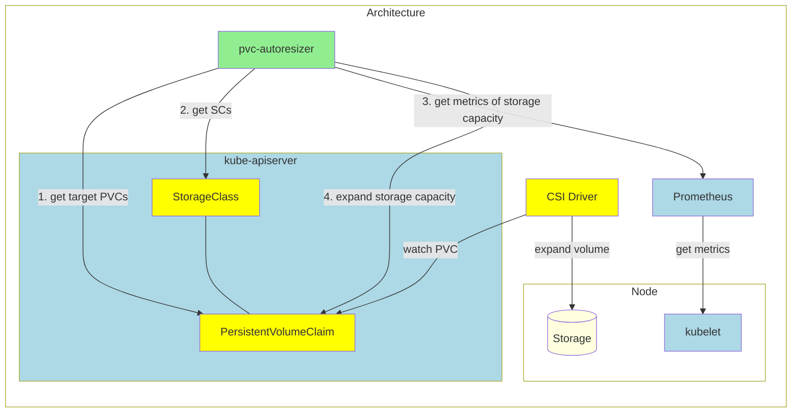

# Design notes

## Motivation

Resizable persistent volumes (PVs) make operations of applications easier when
it is difficult to predict the storage size required for the applications.

That said, it can be a hassle to resize them one by one manually if there are
a lot of such persistent volumes.

## Goal

- Automate resizing of persistent volumes using filesystem usage metrics.
- Users can configure resizing parameters for each PVC.
- Users can enable this feature only for specific StorageClasses.

## Target

- CSI drivers which support [`VolumeExpansion`](https://kubernetes.io/docs/concepts/storage/persistent-volumes/#csi-volume-expansion) (ex. TopoLVM, Ceph-CSI).
- Only Filesystem volume mode (not Block).

## Architecture



### How pvc-autoresizer works

To expand PVC, pvc-autoresizer works as follows:

1. Get target PVC information from `kube-apiserver`.
2. Get StorageClass related to the PVC from `kube-apiserver`.
3. Get filesystem usage metrics from Prometheus that scrapes the information from `kubelet`.
4. Expand PVC storage request size if PVC has less than the specified amount of free filesystem capacity. 

### Details

To enable pvc-autoresizer, prepare StorageClass as follows:

```yaml
kind: StorageClass
apiVersion: storage.k8s.io/v1
metadata:
  name: topolvm-provisioner
  annotations:
    resize.topolvm.io/enabled: "true" 
provisioner: topolvm.io
parameters:
  "csi.storage.k8s.io/fstype": "xfs"
volumeBindingMode: WaitForFirstConsumer
allowVolumeExpansion: true
```

- To allow automatic resizing, StorageClass must have `resize.topolvm.io/enabled` annotation. 
- `allowVolumeExpansion` should be `true`.

In addition to the StorageClass, prepare PVC as follows:

```yaml
kind: PersistentVolumeClaim
apiVersion: v1
metadata:
  name: topolvm-pvc
  annotations:
    resize.topolvm.io/threshold: 20%
    resize.topolvm.io/inodes-threshold: 20%
    resize.topolvm.io/increase: 20Gi
    resize.topolvm.io/storage_limit: 100Gi
spec:
  accessModes:
  - ReadWriteOnce
  volumeMode: Filesystem
  resources:
    requests:
      storage: 30Gi
  storageClassName: topolvm-provisioner
```

- `spec.storageClassName` should be put above StorageClass (in this case "topolvm-provisioner").
- To allow automatic resizing, PVC must have `resize.topolvm.io/storage_limit` annotation.
  We could have configured with `spec.resources.limits.storage`, but it is deprecated.
- pvc-autoresizer increases PVC's `spec.resources.requests.storage` up to the given limits.
- The threshold of free space is given by `resize.topolvm.io/threshold` annotation.
- The threshold of free inodes is given by `resize.topolvm.io/inodes-threshold` annotation.
- The amount of increased size can be specified by `resize.topolvm.io/increase` annotation.
- The value of the annotations can be a ratio like `20%` or a value like `10Gi`.
- The default value for both threshold and amount is `10%`.
- `spec.volumeMode` must be Filesystem (default is Filesystem).
